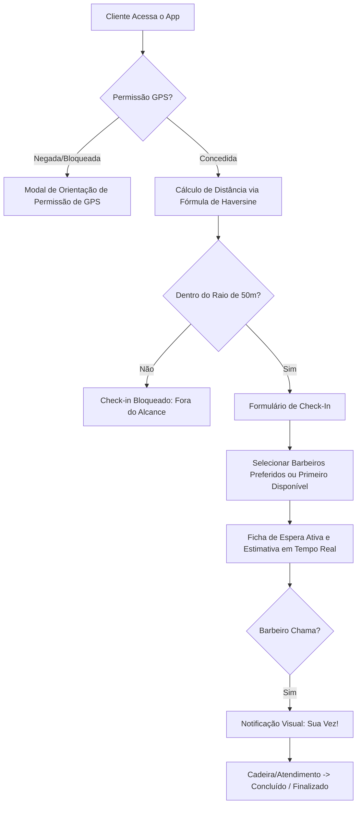

# 💈 BarberFlow - Gerenciador de Filas em Tempo Real

BarberFlow é uma aplicação web progressiva (PWA) premium para gerenciamento de filas de espera em barbearias em tempo real. Desenvolvido com **Vue 3 (Composition API, TypeScript, Vite)** e integrado ao **Firebase (Auth/Firestore)**, o sistema conta com um design escuro e glassmórfico refinado, controle de presença via geofencing e suporte multilíngue dinâmico (lazy loading).

O projeto possui um **Motor de Simulação Local (Demo Mode)** integrado, permitindo que a aplicação seja executada e testada localmente em segundos sem a necessidade de chaves do Firebase.

---

## 🚀 Fluxo de Funcionamento (Arquitetura)



---

## ✨ Principais Funcionalidades

### 1. 📍 Validação por Geofencing (Cerca Geográfica)
* **Prevenção de Inscrições Falsas:** Clientes só podem entrar na fila se estiverem fisicamente a uma distância de até **50 metros** das coordenadas centrais da barbearia.
* **Cálculo Preciso:** Utiliza a fórmula de Haversine para determinar a distância exata a partir da latitude e longitude atuais obtidas por geolocalização de alta precisão.
* **Experiência Fallback (UX):** Caso o cliente negue a permissão de GPS, um modal dinâmico fornece instruções ilustradas baseadas no navegador do usuário para reativar as permissões de localização.
* **Simulador integrado no Modo Demo:** Inclui um painel interativo de simulação para alternar instantaneamente entre a simulação de estar "Dentro" (0 metros) ou "Fora" (1,2 km) da loja.

### 2. 🌐 Tradução Dinâmica com Lazy Loading (`vue-i18n`)
* **Detecção Automática:** O sistema detecta o idioma padrão através das configurações do navegador (`navigator.language`) e persiste a preferência selecionada em `localStorage`.
* **Carregamento sob demanda (Lazy Loading):** As traduções em inglês (`en.json`) e português (`pt.json`) são divididas em chunks assíncronos que só são baixados se o usuário selecionar ou precisar do idioma.
* **Sem Flash de Texto Não Traduzido:** Um guarda de rotas integrado pré-carrega o chunk de idioma necessário *antes* da renderização da página.

### 3. ⏱️ Fila Interativa em Tempo Real
* **Painel do Cliente:** Exibe a posição atual na fila, a estimativa de tempo de espera calculada dinamicamente de acordo com o tempo médio do barbeiro selecionado, o status da ficha ("Aguardando", "Em Atendimento", "Concluído", "Cancelado") e as preferências.
* **Seleção Fluida de Preferência (UX):** O cliente pode selecionar qualquer profissional diretamente no grid. O sistema desmarca automaticamente a opção "Primeiro Disponível", removendo a necessidade de ações manuais redundantes.
* **Painel Administrativo (Barbeiros):**
  * **Tempo Médio de Atendimento Customizável:** Cada barbeiro pode definir seu tempo médio de atendimento geral (entre 5 e 120 minutos) diretamente em seu cartão de perfil. A alteração é salva instantaneamente e reflete nas estimativas de fila em tempo real.
  * Alteração de status individual: **Disponível** ou **Em Pausa (Away)**.
  * Chamamento do próximo cliente baseado em um algoritmo de correspondência (clientes que selecionaram o barbeiro especificamente ou optaram por "Primeiro Disponível").
  * Início, término e cancelamento/marcação de ausência de clientes com sincronização instantânea.
  * Gerenciamento de equipe (cadastro de profissionais e exclusão de funcionários).
  * Atualização da configuração geográfica e do nome do estabelecimento em tempo real.

### 4. 📴 Suporte a PWA (Progressive Web App)
* **Instalação Local:** Ícones de inicialização e manifest configurados para instalação direta no celular ou desktop.
* **Service Worker:** Cache offline inteligente usando o Workbox (gerado no build de produção com `vite-plugin-pwa`).

---

## 🛠️ Stack Tecnológica

* **Framework Principal:** [Vue 3](https://vuejs.org/) (Composition API com SFCs `<script setup>`)
* **Linguagem:** [TypeScript](https://www.typescriptlang.org/)
* **Gerenciador de Rotas:** [Vue Router](https://router.vuejs.org/)
* **Internacionalização:** [vue-i18n v9+](https://vue-i18n.intlify.dev/)
* **Estilização:** Vanilla CSS premium (sistema dark/glassmorphic customizado em `src/style.css`)
* **Pacote de Ícones:** [Lucide Vue Next](https://lucide.dev/)
* **Empacotador:** [Vite](https://vite.dev/)
* **Banco de Dados / Backend:** [Firebase Core / Auth / Firestore](https://firebase.google.com/)

---

## 📂 Estrutura do Projeto

```bash
barberShop/
├── public/                 # Assets públicos do PWA (manifest, ícones)
├── src/
│   ├── assets/             # Imagens e logotipos locais
│   ├── components/         # Componentes dinâmicos de interface
│   │   ├── ActiveWaitScreen.vue  # Visualização de espera do cliente
│   │   ├── ClientCheckIn.vue     # Formulário de entrada na fila
│   │   ├── GeofencingGuard.vue   # Validador de GPS e simulação de distância
│   │   ├── AdminQueue.vue        # Painel operacional do barbeiro ativo
│   │   └── AdminSettings.vue     # Configurações da barbearia e CRUD de equipe
│   ├── composables/        # Hooks e composição de lógica (useBarberAuth.ts)
│   ├── locales/            # Dicionários de tradução (en.json, pt.json)
│   ├── router/             # Configurações de navegação e guards pré-load
│   ├── services/           # Camada de comunicação com banco e motor Mock
│   ├── types/              # Tipos TypeScript centralizados (index.ts)
│   ├── utils/              # Funções utilitárias auxiliares (timeUtils.ts)
│   ├── App.vue             # Elemento raiz com switcher de idioma global
│   ├── i18n.ts             # Configuração central e carregador lazy do vue-i18n
│   ├── main.ts             # Inicialização do app e injeção de plugins
│   └── style.css           # Variáveis do sistema de design e estilos globais
├── firestore.rules         # Regras de segurança do Firestore
└── vite.config.ts          # Configuração do Vite e gerador PWA
```

---

## 🎛️ Modo de Demonstração (Demo Mode) vs Produção

Por padrão, a aplicação detecta se existem variáveis de ambiente configuradas para o Firebase. Se não existirem, o **Modo de Demonstração** é ativado automaticamente.

* **Banco de Dados Mock:** Simula o Firestore gravando os dados em `localStorage`.
* **Autenticação Simulada:** Permite fazer login utilizando qualquer uma das credenciais cadastradas com qualquer senha:
  * `marcos@barber.com` (Status padrão: Disponível)
  * `thiago@barber.com` (Status padrão: Disponível)
  * `felipe@barber.com` (Status padrão: Em Pausa)
* **Sincronização em Tempo Real (Cross-Tab):** Simulado através do evento `storage` da Web API para sincronizar instantaneamente o estado do banco entre múltiplas abas abertas no mesmo navegador (e.g. aba do barbeiro atualizando a estimativa na aba do cliente em tempo real).

### Configurando o Firebase em Produção

Crie um arquivo `.env` na raiz do projeto com as chaves do seu projeto Firebase:

```env
VITE_FIREBASE_API_KEY=sua_api_key
VITE_FIREBASE_AUTH_DOMAIN=seu_auth_domain
VITE_FIREBASE_PROJECT_ID=seu_project_id
VITE_FIREBASE_STORAGE_BUCKET=seu_storage_bucket
VITE_FIREBASE_MESSAGING_SENDER_ID=seu_sender_id
VITE_FIREBASE_APP_ID=seu_app_id
VITE_SUPABASE_URL=https://peqwujowabklxftunijd.supabase.co
VITE_SUPABASE_PUBLISHABLE_KEY=sb_publishable_Hmj2Z22BovIYrh4yG8minQ_SyieRsFc
```

---

## 💻 Como Rodar o Projeto

### Instalação de Dependências
```bash
npm install
```

### Executar em Desenvolvimento (Local)
```bash
npm run dev
```
Acesse `http://localhost:5173/` no seu navegador.

### Build para Produção
```bash
npm run build
```
O build compila a aplicação gerando chunks de idioma dinâmicos separados na pasta `dist/assets/`, registrando o manifest e gerando o PWA service worker.

### Visualizar Build de Produção Localmente
```bash
npm run preview
```

### 🧪 Executando os Testes de Integração (Playwright)
O projeto conta com uma suíte de testes automatizados de ponta a ponta que valida fluxos de autenticação reativa, geofencing, internacionalização e cálculo dinâmico de fila:

```bash
# Instalar Playwright no ambiente Python (caso não possua)
pip3 install playwright
python3 -m playwright install chromium

# Executar a suíte de testes (necessita do servidor "npm run dev" rodando na porta 5173)
python3 skills/webapp-testing/test_barberflow.py
```
